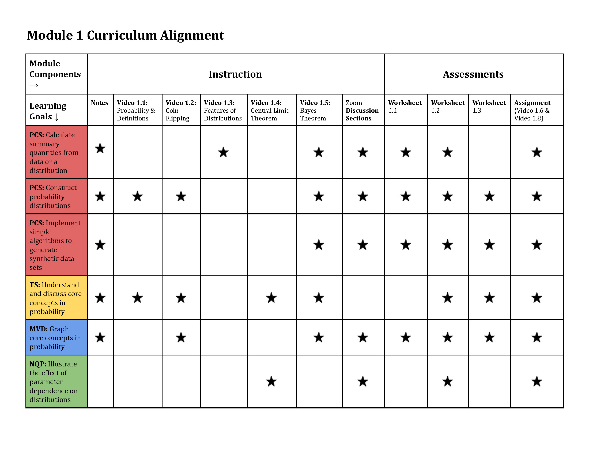

# Module 1: The Basics

This page is meant to serve as a landing page for everything about Module 1.  The materials in Module 1 are centered on six themed learning goals shown in the table below.  The stars indicate where you can learn or practice mastery of these goals in the course content.  For more information on curriculum alignment tables, go [here](../CurriculumAlignmentTables).

The course notes can be found [here](Module1_CourseNotes) and the recorded lectures will be made available to enrolled students.

There are three worksheets [here](Worksheet_1_1_CoinFlipping), [here](Worksheet_1_2_SquareRootN), and [here](Worksheet_1_3_EffectOfPriors_Guide).

The assignment details can be found [here](Assignment_1).